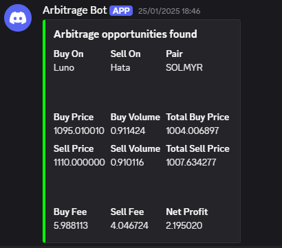

# Malaysia Crypto Exchange Arbitrage

Malaysia Crypto Exchange Arbitrage is a cutting-edge software designed to identify and analyze arbitrage opportunities across multiple cryptocurrency exchanges in Malaysia. The project features a robust backend for crypto price analysis.

## Showcase



## Features

- **Real-Time Arbitrage Detection**: Monitors multiple exchanges for price discrepancies.

## Tech Stack

- **Backend**: Go (Golang)
- **Build Tools**: Makefile

## Note on Server Architecture

The codebase includes an API server architecture, but it is currently not used. All core logic runs directly via the main executable. The frontend UI and backend logic operate independently, and the API server can be enabled in future versions.

## Getting Started

### Prerequisites
- [Go](https://golang.org/) (latest)
- [Docker](https://www.docker.com/)
- [Air](https://github.com/cosmtrek/air) (optional, for live reload)

### Installation
1. Clone the repository:
   ```bash
   git clone https://github.com/your-username/malaysia-crypto-exchange-arbitrage.git
   cd malaysia-crypto-exchange-arbitrage
   ```

### Usage

#### Build the Application
```bash
make build
```

#### Run the Application
```bash
make run
```

#### Live Reload for Development
```bash
make watch
```

#### Clean Up Build Artifacts
```bash
make clean
```

## Project Structure

```
malaysia-crypto-exchange-arbitrage/
├── cmd/                # Main application entry points
├── frontend/           # React + TypeScript frontend
├── internal/           # Core business logic and services
├── logs/               # Application logs
├── Makefile            # Build and run commands
├── Dockerfile          # Docker configuration
├── docker-compose.yml  # Docker Compose setup
└── README.md           # Project documentation
```

## Contributing
Contributions are welcome! Please fork the repository and submit a pull request.

## License
This project is licensed under the MIT License. See the LICENSE file for details.

## Acknowledgments
- Inspired by the need for efficient cryptocurrency trading tools.
- Built with love by the open-source community.
